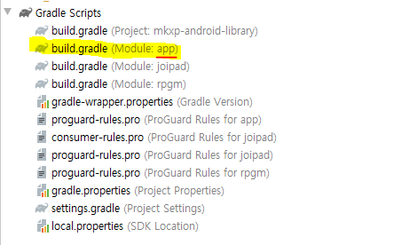
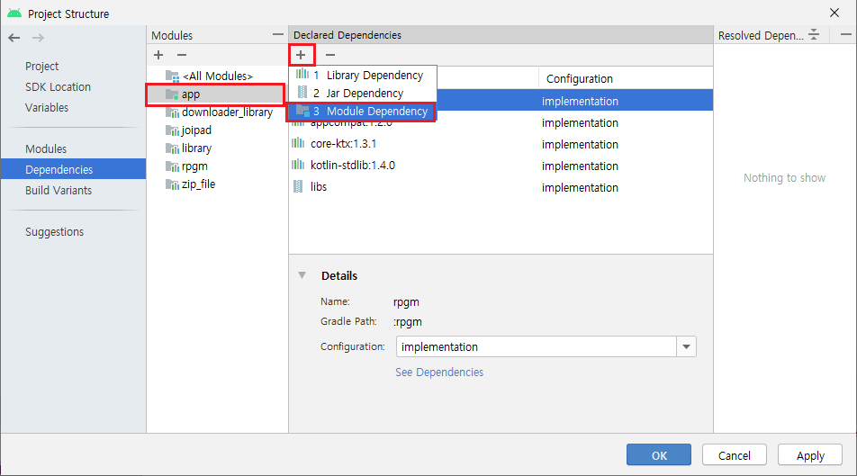
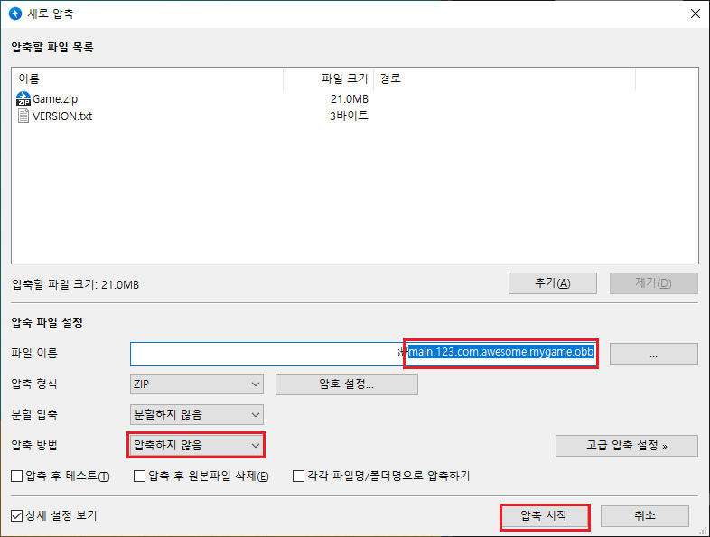
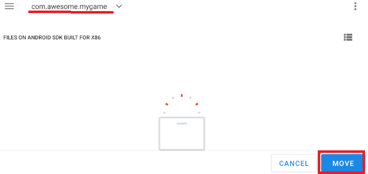

# build-apk-with-mkxp
**mkxp**를 활용한, 알만툴(RPG Maker)로 제작된 게임의 안드로이드 포팅 과정을 기술한 매뉴얼입니다. 과정을 똑같이 따라서 진행해도 도중에 예상치 못한 버그 또는 오류가 발생할 수 있음을 유의하세요.

# 시작하기 전
아래 내용을 반드시 꼼꼼하게 숙지 후 포팅을 진행하세요.

## 사용 조건
* 이 포팅은 RPG Maker `XP`/`VX`/`VXA` 시리즈만 가능합니다. 이외의 버전은 포팅이 불가능합니다.

* 반드시 RPG Maker 제품의 RTP (Run-time Package)를 사용하지 마세요.
  * mkxp 엔진을 사용한 이상, RTP 에셋들을 게임에 적용한 상태에서 **배포**할 시 [RPG Maker RTP 라이센스 약관](https://www.rpgmakerweb.com/run-time-package)에 위반됩니다.

* 반드시 인게임에 mkxp 라이센스 사항(**저장소 url 포함**)을 명시하세요.
  * mkxp는 오픈소스 라이센스 GNU v2+를 따릅니다.
  * 표기 예시 1) `본 게임은 mkxp 엔진 joiPlay fork 버전을 적용하였으며, GNU Public v2+ 라이센스를 따릅니다. (저장소: https://github.com/joiplay/android-mkxp)`
  * 표기 예시 2) `This game works on joiPlay's mkxp fork, which is licensed under GNU Public License v2+. (link: https://github.com/joiplay/android-mkxp)`

## 버그/이슈 발생 가능성
* 이 프로젝트는 RGSS가 아닌 **mkxp**를 사용합니다. mkxp가 RGSS에 버금가는 호환성을 갖추었다 하더라도 내부 동작은 서로 다를 수 있습니다. (예: 폰트 렌더링, 세이브 파일 저장 위치 등)

* 따라서 사용중인 외부 스크립트 일부가 mkxp 환경에서 동작하지 않을 수 있습니다. 안타깝지만, 해당 스크립트를 직접 수정하거나 포기해야 할 가능성이 높습니다.
  * `Win32API`, `dll 파일`, `DL.open` 를 사용하는 스크립트들은 안드로이드에서 동작하지 않으므로 지우세요. (Win32API 일부 호환이 되지만, 그 수가 극히 적습니다.)
 
* 폴더/파일명에 한글이 들어간다면 1바이트 문자인 영어 또는 숫자, 특수문자 등으로 바꾸세요.

* 안드로이드에서는 RTP 폴더 위치를 못 찾습니다. 테스트 삼아 RTP를 사용할 때에는 게임 프로젝트에 합쳐서 사용합니다.

# 프로젝트 파일 다운로드
링크: https://www.dropbox.com/s/3e5nymzv92yyv95/mkxpandroidlibrary.7z?dl=0

*mkxpandroidlibrary.7z* 파일의 압축을 풉니다.

# 안드로이드 스튜디오
## 다운로드 및 설치
https://developer.android.com/studio

다소 무거운 소프트웨어입니다. 2020년 9월 1일 Windows 기준으로 램은 4GB가 최소, 8GB가 권장 사양입니다. 컴퓨터 사양이 낮다면 작업 속도가 느릴 것입니다.

## 프로젝트 파일 열기


`Open an existing Android Studio project`를 누릅니다.


1. 압축을 풀은 프로젝트 폴더를 선택하고 `OK`를 누릅니다.

2. 하단 상태 바에 `Gradle: Build...` 라는 상태 메세지가 사라질 때까지 기다립니다.

## SDK 툴 설치
상단 메뉴 `Tools` > `SDK Manager` 를 누릅니다.


`Android SDK` 섹션 > `SDK Tools` 탭 클릭 후 아래의 리스트에 모두 체크 하고 OK 를 누르면 설치를 진행합니다.

- [x] Android Emulator
- [x] Android SDK Platform-Tools
- [x] Google Play APK Expansion library
- [x] Google Play Licensing Library
- [x] Intel x86 Emulator Accelerator (HAXM installer)

## 에??

## 에뮬레이터 추가하기
상단 메뉴 `Tools` > `AVD Manager` 를 누릅니다. 이것은 Android 가상 기기 매니저 창을 띄웁니다.


`Create Virtual Device` 버튼을 누릅니다.


사용할 가상 기기를 선택한 후, `Next`를 누릅니다. Play Store 아이콘이 있는 것을 선택하는 것을 권장합니다.


원하는 Release를 *Download* 한 뒤에 선택하세요. 글쓴이는 `Q (API Level 29)`를 선택했습니다. `Next`를 누릅니다.


`Show Advanced Settings` 버튼 - `Internal Storage`와 `SD Card`의 **용량**을 적절하게 설정합니다. 다음 `Finish`를 누릅니다.


`▶` 버튼을 눌러 가상 기기 전원이 켜지는지 확인합니다.

## 게임 프로젝트 파일 추가하기

1. `./app/src/main/assets` 폴더로 이동합니다.
2. 게임 프로젝트의 `Game.ini` 파일을 1번의 주소로 복사합니다.
3. 게임 프로젝트를 통째로 `Game.zip` 라는 이름으로 **압축**하여 1번의 주소로 복사합니다.
  
### 주의사항

* **반드시** 반디집 기준으로 `Game.zip으로 압축하기`를 선택해야 합니다. `반디집으로 압축하기`로 압축하면 파일을 인식하지 못합니다. 알집도 마찬가지입니다.

## 게임 환경 설정하기 (선택 사항)

1. `./rpgm/src/main/assets` 폴더로 이동합니다.
* `mkxp.conf` 파일은 게임 실행 시 여기에 저장된 세팅값을 실행합니다.
  * `RTP` 속성값은 반드시 `Game.zip` 으로 설정하세요.
  * `RTP=OBB_PATH` 라인은 동작하지 않습니다. 지우세요.
* `prewrite.rb` 파일은 게임이 실행하기 전, 미리 실행할 루비 스크립트를 넣는 곳입니다.

## 어플리케이션 아이디와 게임 버전 수정하기



`build.gradle (Module: app)` 파일에서 수정할 수 있습니다.

```gradle
...
    defaultConfig {
        applicationId "com.awesome.mygame"
        minSdkVersion 21
        targetSdkVersion 29
        versionCode 123
        versionName "1.2.3"

        testInstrumentationRunner "androidx.test.runner.AndroidJUnitRunner"
    }
...
```

* `applicationId` 는 어플리케이션의 고유 패키지 아이디입니다. 다른 앱의 아이디와 완전히 중복되지 않도록 설정하세요. 보통 `com.<회사명>.<프로젝트명>` 와 같이 작성합니다. 영어 소문자만 적을 것을 권장합니다.
  * 예시의 값은 `com.awesome.mygame` 입니다.
* `versionCode` 는 어플리케이션의 버전번호입니다. 자연수만 사용할 수 있고 실제 버전을 비교할 때 사용됩니다.
  * 예시의 값은 `123` 입니다.
* `versionName` 은 비교용으로 사용하지 않고, 단순히 사용자에게 버전 텍스트를 보여주기만 합니다.
  * 예시의 값은 `1.2.3` 입니다. `v1.2.3` 처럼 표기해도 상관 없습니다.

## 어플리케이션 이름 수정하기

`./src/main/res/values/strings.xml` 파일에서 수정할 수 있습니다. 아래는 이름을 MyGame으로 지은 예제 코드와 결과입니다.

**코드**
```xml
<resources>
    <string name="app_name">MyGame</string>
</resources>
```
**결과**


## 앱 아이콘 변경하기

1. 메뉴 `File` > `New` > `Image Asset` 에서 이미지를 만듭니다.
2. `./src/main/AndroidManifest.xml` 파일에 관련 코드를 추가합니다.
* 자세한 설명은 링크로 대신합니다: https://webnautes.tistory.com/1306

## 빌드하기

1. 메뉴 `Build` > `Clean Project` 를 누릅니다.
2. 메뉴 `Build` > `Rebuild Project` 를 누릅니다.

## 테스트하기
* `Run` (초록색 ▶ 모양 버튼)을 누르면 에뮬레이터와 어플리케이션이 자동으로 실행됩니다.

## 배포용 apk 파일 만들기
1. 메뉴 `Build` > `Generate Signed Bundle / APK...` 를 누릅니다.


2. `APK` 선택 후 `Next`를 누릅니다.


3. `Create new...` 를 누릅니다. 키스토어 만드는 작업은 최초 1회만 하면 됩니다.
  


4. 키스토어 저장경로, 비밀번호, 아이디, 각종 정보들을 입력하고 `OK`를 누릅니다.


* 이런 오류 메세지가 뜨는 경우가 있는데 무시하세요.


5. - [x] Remember passwords 에 체크합니다. 다음 `Next`를 누릅니다.


6. release, V1, V2 선택 후 `Finish`를 누릅니다.
7. `./app/release` 에 `app-release.apk` 가 만들어졌는지 확인합니다.

# 구글 플레이 스토어 출시를 고민한다면
## 시작하기 전
* 먼저 플레이 스토어 개발자 등록 신청을 해야 합니다. 가격은 $25 이며, 유효기간은 영구 지속됩니다.
* apk 파일의 용량이 100MB를 넘는지 확인하세요. 100MB가 넘는다면, 추가적인 작업이 필요합니다.
* apk에서 게임 프로젝트 파일을 분리해 따로 obb 파일을 만들어 업로드하는 것입니다. 즉, apk 파일과 obb 파일 두 개를 업로드 하는 방법입니다.
* 이 링크에서 자세한 내용을 알 수 있습니다. https://developer.android.com/google/play/expansion-files

## 안드로이드 스튜디오 세팅
1. `./src/main/java/cyou/joiplay/rpgm/MainActivity.java` 파일을 새로운 [MainActivity.java](https://github.com/jubin-park/build-apk-with-mkxp/blob/master/MainActivity.java) 파일로 덮어씌웁니다.
2. Android SDK 창을 열어, Android SDK 경로를 클립보드에 복사해서 메모장에 3줄 붙여넣습니다.

```
(SDK 경로)
(SDK 경로)
(SDK 경로)
```
3. 각 줄에 아래의 경로를 덧붙입니다.
```
(SDK 경로)/extras/google/market_apk_expansion/downloader_library
(SDK 경로)/extras/google/market_apk_expansion/zip_file
(SDK 경로)/extras/google/market_licensing/library
```

4. `(SDK 경로)/extras/google/market_apk_expansion/downloader_library/project.properties` 파일을 메모장으로 열어서 아래의 코드 라인을 지우고 저장합니다.
```properties
android.library.reference.1=../market_licensing
```

5. 메뉴 `File` > `New` > `Import Module...` 를 누릅니다.
6. Source directory에 한 줄씩 경로를 넣고 `Next` 를 누른 뒤, `Finish`를 누릅니다.


7. `downloader_library`, `library`, `zip_file` 모듈이 추가됐는지 확인합니다.
8. 메뉴 `File` > `Project Structure` 를 누릅니다.


9. `Dependencies` > `downloader_library` > `+` > `Module Dependency` 를 누릅니다.


- [x] library 에 체크 후 `OK`를 누릅니다.


10. `Dependencies` > `app` > `+` > `Module Dependency` 를 누릅니다.


11. 
- [x] downloader_library
- [x] library
- [x] zip_file

위 3개 모듈에 체크하고 `OK`를 누릅니다.

12. 위와 같은 에러 메세지가 나오면 `Remove minSdkVersion` 를 누릅니다.
```
The minSdk version should not be declared in the android manifest file. You can move the version from the manifest to the defaultConfig in the build.gradle file.
Remove minSdkVersion and sync project
Affected Modules: downloader_library, library, zip_file
```


13. 오류나는 부분을 하나씩 찾아가서 빨간색으로 표시한 부분을 지웁니다.

```xml
<uses-sdk android:minSdkVersion="4" android:targetSdkVersion="15"/>

=>

<uses-sdk android:targetSdkVersion="15"/>
```

14.  빌드를 시도합니다.


* *MainActivity.java* 14줄에 에러가 나면 `zip_file` 의존성 추가합니다.

## obb 파일 만들기

1. `./app/src/main/assets` 폴더로 이동합니다.
2. `Game.zip` 파일을 다른 곳으로 이동시키거나 지웁니다.
   * 이 폴더에는 `Game.ini` 파일만 남아있으면 됩니다.

3. `VERSION.txt` 파일을 새로 만들어서 그 안에 버전 번호를 적고 저장합니다. 버전 번호가 123 이라면 그대로 적습니다.
```
123
```


4. `Game.zip` 과 `VERSION.txt` 을 반디집 기준 `반디집으로 압축하기` 를 누릅니다.



5. 파일 이름을 `main.<버전번호>.<패키지아이디>.obb` 파일로 저장합니다.
   * 예: 버전 번호가 `123`, 패키지 아이디가 `com.awesome.mygame` 이라면 파일 이름은 `main.123.com.awesome.mygame.obb`
   * 반드시 압축 방법은 `압축하지 않음`으로 선택해야 합니다.
   * `압축 시작`을 누릅니다.


6. obb 파일을 에뮬레이터에 드래그 앤 드롭합니다.

7. ▶를 눌러 에뮬레이터와 게임을 실행합니다. obb 폴더를 자동 생성하도록 하기 위함입니다. Unable to open 'Data/Scripts.rxdata' 메세지가 나오면 OK 를 눌러 종료합니다.

8. 파일 관리자 어플을 실행합니다.


9. Downloads 폴더로 이동합니다.


10. 메뉴에서 `Show internal storage` 를 누릅니다.


11. `Move to...` 를 누릅니다.




12. `내부 폴더` > `Android` > `obb` > `패키지 아이디` 폴더로 이동해서 `MOVE` 를 누릅니다.

13. 게임이 잘 실행되는지 확인합니다.

## 업로드 및 출시하기
구글 플레이 스토어에서 `app-release.apk` 파일과 obb 파일을 업로드 합니다. 여기서는 자세히 다루지 않습니다. [여기](https://developer.android.com/google/play/expansion-files)를 눌러 참고하세요.

# 버그 및 이슈
* obb 파일 사용 시, 게임을 실행할 때마다 obb 파일을 internal storage에 복사하므로 용량이 클 수록 오버헤드가 심각해짐
  - [x] 업데이트 때마다 최초 한 번만 복사하는 아이디어 필요
    - [x] `VERSION.txt` 로 버전 확인하는 방법으로 해결

# 크레딧
저에게 도움을 주신 *눈물향수*님, 템플릿 파일을 제공해주신 *joiPlay 개발자*님, 그리고 *mkxp 개발자 여러분*께 감사의 인사를 드립니다.